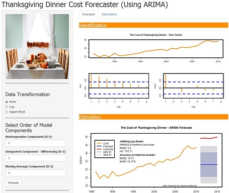
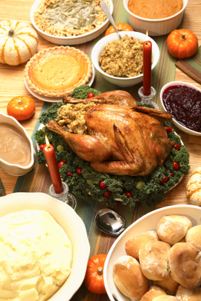

---
title       : Thanksgiving Dinner Cost Forecaster
subtitle    : Using ARIMA
author      : Jared Roy Endicott
job         : Forecaster
framework   : io2012       # {io2012, html5slides, shower, dzslides, ...}
highlighter : highlight.js  # {highlight.js, prettify, highlight}
hitheme     : tomorrow      # 
widgets     : mathjax            # {mathjax, quiz, bootstrap}
mode        : selfcontained # {standalone, draft}
knit        : slidify::knit2slides 

--- &twocol

## The cost of Thanksgiving Dinner changes every year. How can you predict what these prices changes? 

*** =left
 

*** =right
* The cost of a traditional Thanksgiving Dinner for 10 people has gone from 28.74 in 1986 to a whopping 50.11 in 2015. 
* This is an a total price increase of 74.36% and an average annual inflation rate of 2.48%.
* The cost increased by 13.18% between 2010 and 2011, but only by 1.27% between 2011 and 2015.
* How much will the price increase next year? What about the next five years?  

--- 

## Use ARIMA

### ARIMA stand for Autoregressive Integrated Moving Averages

What does autoregressive integrated moving averages even mean?

Are you tired of having to try and solve equations like this by hand?

$$ Ŷ_t = Y_t-1 + ϕ1(Y_t-1 - Y_t-2) - θ_1et-1 - θ_1et-1 $$

### With All the Confusion Why Forecast Using ARIMA?

* ARIMA outperforms Exponential Smoothing in about 45% of times series forecasts!
* ARIMA doesn't just rely on season, trend, and error variables, but can take advantage of autocorrelations in time series data!
* ARIMA makes optimal forecasts under certain theoretical assumptions, such as stationarity and homoscedasticity!
* ARIMA outperforms other times series models in testing on Thanksgiving Dinner cost forecasts!

--- &twocol

## Use the Thanksgiving Dinner Cost Forecaster!!!

*** =left

*** =right
* Play with the parameters!
* See what happens to the charts!
* See what happens to the diagnostic statistics and charts!
* Use the Box-Jenkins methodology for model selection...or not!
* Use your parameter selections for forecast the cost of Thanksgiving Dinner for the next five years!

--- &twocol 

## Prepare for Next Year's Thanksgiving

*** =left

*** =right
* So what are you waiting for?
* Try out the Thanksgiving Dinner Cost Forecaster today!
* App is available at the following link:

[Thanksgiving Dinner Cost Forecaste](https://realizingfutures.shinyapps.io/ThanksgivingArimaApp)

