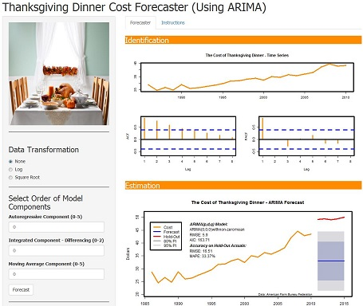
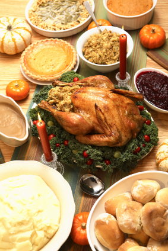

---
title       : Thanksgiving Dinner Cost Forecaster
subtitle    : Using ARIMA
author      : Jared Roy Endicott
job         : Forecaster
framework   : io2012       # {io2012, html5slides, shower, dzslides, ...}
highlighter : highlight.js  # {highlight.js, prettify, highlight}
hitheme     : tomorrow      # 
widgets     : mathjax            # {mathjax, quiz, bootstrap}
mode        : selfcontained # {standalone, draft}
knit        : slidify::knit2slides 

--- &twocol

## The cost of Thanksgiving Dinner changes every year. How can you predict what these prices changes? 

*** =left
``` {r echo=FALSE, warning=FALSE, message=FALSE}
## load Packages
library(XML); library(data.table); library(forecast); library(tseries); library(dplyr); library(knitr)

## get Thanksgiving Dinner data from the American Farm Bureau Federation
fileUrl <- "http://www.fb.org/newsroom/news_article/369/"
doc <- htmlTreeParse(fileUrl, useInternal=TRUE)

## locate the XML that has the table data and begin filtering it
thanks.raw <- xpathApply(doc,"//td[@valign='top']", xmlValue)
thanks.raw[1:5] <- NULL

## loop through raw XML and extract the Thanksgiving Dinner price and year
Year <- NULL
date <- NULL
price <- NULL
x <- 1
while(thanks.raw[[x]]!="Item"){
        if(nchar(thanks.raw[[x]])==4) {
                Year = c(Year, thanks.raw[[x]])
                date = c(date, 
                            paste(thanks.raw[[x]], "-11-01", sep=""))
                } 
        if(nchar(thanks.raw[[x]])==6) {
                price = c(price, 
                             as.numeric(substr(thanks.raw[[x]], 2, 6)))
                }
        x <- x + 1
}

## create a date table with the thanksgiving dinner prices
thanks.prices <- data.table(date = as.Date(date), Year, 
        series_name = "Thanksgiving", value = price)

par(mfrow = c(1,1), cex = 0.75)
usr <- par("usr") # get user coordinates 

x <- thanks.prices$Year
y <- thanks.prices$value

plot(x, y, type = "l", col = "darkorange", lwd = 2,
     main = "" , 
     xlab = "Year", 
     ylab = "Dollars")
par(usr = c(0, 1, 0, 1))
text(0.05, 0.78, paste("The Cost of Thanksgiving Dinner (", first(x), " - ", last(x), ")", sep=""), cex = 1.2, adj = 0, font=4)
text(0.05, 0.70, paste(first(x), ": ", first(y), sep=""), adj = 0)
text(0.05, 0.64, paste(last(x), ": ", last(y), sep=""), adj = 0)
text(0.05, 0.58, paste("Total Inflation: ", sprintf('%1.2f%%', 100*cost.change), sep=""), adj = 0)
text(0.05, 0.52, paste("Average Annual Inflation: ", sprintf('%1.2f%%', 100*cost.change.avg), sep=""), adj = 0)
text(0.55, 0.03, "Data: American Farm Bureau Federation", cex = 0.75, adj = 0)
par(usr = usr) # restore original user coordinate
```

*** =right
* The cost of a traditional Thanksgiving Dinner for 10 people has gone from 28.74 in 1986 to a whopping 50.11 in 2015. 
* This is an a total price increase of 74.36% and an average annual inflation rate of 2.48%.
* The cost increased by 13.18% between 2010 and 2011, but only by 1.27% between 2011 and 2015.
* How much will the price increase next year? What about the next five years?  

--- 

## Use ARIMA

### ARIMA stand for Autoregressive Integrated Moving Averages

What does autoregressive integrated moving averages even mean?

Are you tired of having to try and solve equations like this by hand?

$$ Ŷ_t = Y_t-1 + ϕ1(Y_t-1 - Y_t-2) - θ_1et-1 - θ_1et-1 $$

### With All the Confusion Why Forecast Using ARIMA?

* ARIMA outperforms Exponential Smoothing in about 45% of times series forecasts!
* ARIMA doesn't just rely on season, trend, and error variables, but can take advantage of autocorrelations in time series data!
* ARIMA makes optimal forecasts under certain theoretical assumptions, such as stationarity and homoscedasticity!
* ARIMA outperforms other times series models in testing on Thanksgiving Dinner cost forecasts!


--- &twocol

## Use the Thanksgiving Dinner Cost Forecaster!!!

*** =left


*** =right
* Play with the parameters!
* See what happens to the charts!
* See what happens to the diagnostic statistics and charts!
* Use the Box-Jenkins methodology for model selection...or not!
* Use your parameter selections for forecast the cost of Thanksgiving Dinner for the next five years!


--- &twocol 

## Prepare for Next Year's Thanksgiving

*** =left


*** =right
* So what are you waiting for?
* Try out the Thanksgiving Dinner Cost Forecaster today!
* App is available at the following link:

[Thanksgiving Dinner Cost Forecaster](https://realizingfutures.shinyapps.io/ThanksgivingArimaApp)

